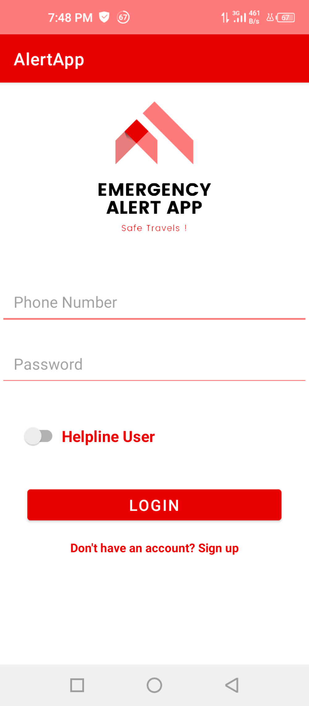
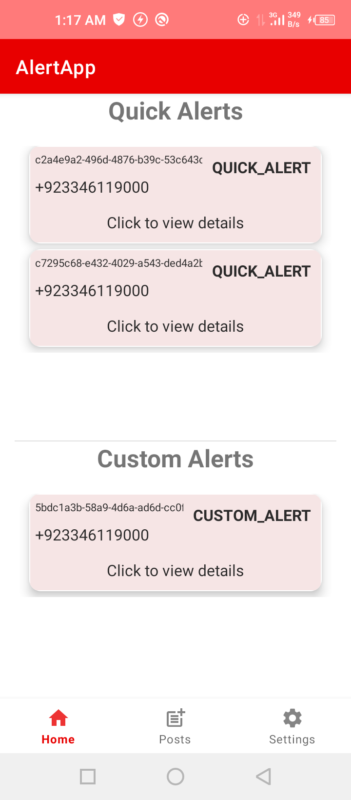

# Emergency Alert App

## Introduction

Welcome to the Emergency Alert App, a safety application designed to help users alert their specified contacts and certain helplines during times of danger.

## Credits

We would like to acknowledge and thank the contributors and sources that have supported the development of this app.

## Getting Started

1. Install the app from the Play Store.
2. Set up your profile by entering a username, phone number, password, gender, and date of birth.
3. Proceed to the sign-in page and log in to your registered account.

## Send Alerts

To use the alert feature:

1. Provide access to your contacts list.
2. Select the contacts you want to notify in case of an emergency.
3. Allow access to location, microphone, camera, and SMS in your phone settings to fully utilize the app's features.

Your data is encrypted and secured for enhanced privacy.

## Custom Alerts

Customize your emergency alert messages by typing your message in the custom alert message box.

## Contact Helplines

In case of an emergency:

1. Click on the "Contact Helplines" feature.
2. Choose from a list of helplines for assistance.

Feel empowered and secure with the Emergency Alert App. Stay safe!

## Screenshots

.png)

